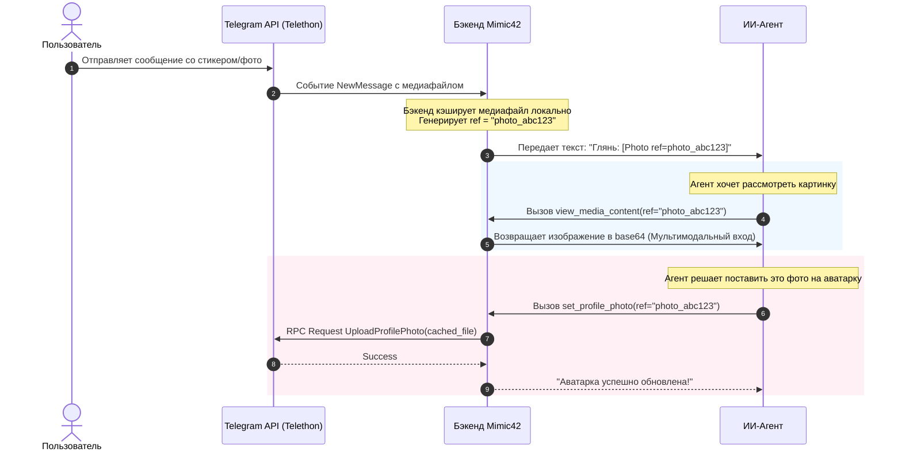

# Архитектурный план: 50 бизнес-ориентированных инструментов Telegram для ИИ-агента

Этот документ описывает проектирование 50 высокоуровневых инструментов (Tools) для ИИ-агента на базе **Telethon** и **LangChain**, полностью абстрагированных от низкоуровневых сущностей Telegram и оптимизированных для контекста LLM.

---

## 1. Базовые принципы проектирования

### А. Принцип "Под капотом" (Абстракция от сущностей Telethon)
Агент не должен знать разницу между `PeerUser`, `PeerChat`, `PeerChannel`, и не должен вызывать `get_entity`. 
* Все параметры получателей принимают универсальную строку `peer` (`@username`, `+79991234567`, `123456789`).
* Разрешение сущности (Entity Resolution) и приведение к `InputPeer` происходят автоматически внутри бэкенда каждого инструмента.

### Б. Безфайловая архитектура медиа (Система Ссылок / Media Refs)
У агента нет доступа к файловой системе. Работа с медиа (фото, видео, стикеры, документы) строится на базе **Media References**:
1. При получении медиа в чате бэкенд сохраняет файл во временном кэше и генерирует уникальный текстовый идентификатор (например, `[Photo ref=photo_9a8b7c]`, `[Sticker ref=stick_123]`).
2. Агент видит этот тег прямо в тексте входящего сообщения.
3. Чтобы "увидеть" изображение, агент вызывает `view_media(ref="photo_9a8b7c")`, и бэкенд возвращает изображение в мультимодальный контекст (base64).
4. Чтобы переслать или использовать медиа (например, поставить на аватарку), агент передает этот же `ref` в соответствующую функцию (`set_profile_photo(ref="photo_9a8b7c")`), не скачивая файл.

### В. Интеграция со стикерами и кастомными эмодзи
* Во входящих сообщениях стикеры отображаются как: `[Sticker ref=stick_xyz emoji=🔥 pack=SarcasticAlex]`.
* Агент может запросить визуализацию стикера (получить его изображение) через `view_media(ref="stick_xyz")`.
* Поиск и отправка выполняются по эмодзи или названию стикерпака, возвращая агенту понятный список доступных `ref` для отправки.

### Г. Группы, Права и Member Tags
* В группах сообщения от пользователей автоматически форматируются с указанием их кастомного статуса/подписи (Member Tag): `[Иван (Администратор/Разработчик)]: Привет`.
* Инструменты модерирования снабжены автоматической предпроверкой прав агента (через инструмент `check_my_permissions`), чтобы агент не пытался совершить невозможное действие.

---

## 2. Перечень 50 инструментов агента

### Категория 1: Сообщения и Диалоги (10 инструментов)

1. `send_text_message(peer: str, text: str, reply_to_msg_id: int = None) -> int`
   * Отправляет обычное текстовое сообщение собеседнику или в группу/канал.
2. `edit_message(peer: str, message_id: int, new_text: str) -> bool`
   * Редактирует ранее отправленное сообщение агента.
3. `delete_messages(peer: str, message_ids: list[int], revoke: bool = True) -> bool`
   * Удаляет выбранные сообщения (с возможностью удалить для всех).
4. `read_chat_history(peer: str, limit: int = 20, offset_id: int = None) -> list[dict]`
   * Читает историю сообщений чата. Автоматически преобразует медиа в `[Media ref=...]` и добавляет Member Tags.
5. `forward_messages(from_peer: str, to_peer: str, message_ids: list[int]) -> list[int]`
   * Пересылает сообщения из одного чата в другой.
6. `send_typing_status(peer: str, action: str = "typing") -> bool`
   * Имитирует активность агента («печатает...», «записывает голосовое...», «выбирает файл...»).
7. `pin_chat_message(peer: str, message_id: int, silent: bool = False) -> bool`
   * Закрепляет сообщение в диалоге или группе.
8. `unpin_chat_message(peer: str, message_id: int = None) -> bool`
   * Открепляет конкретное или последнее закрепленное сообщение.
9. `get_chat_pinned_messages(peer: str) -> list[dict]`
   * Возвращает список всех закрепленных сообщений в чате.
10. `mark_chat_as_read(peer: str, max_id: int = None) -> bool`
    * Помечает сообщения в диалоге как прочитанные.

---

### Категория 2: Работа с Медиа и Файлами (8 инструментов)

11. `view_media_content(ref: str) -> dict`
    * Загружает изображение/файл по ссылке `ref` и передает его в контекст модели (в формате base64 для картинок или текстовой выжимки для документов).
12. `send_media_by_ref(peer: str, ref: str, caption: str = None) -> int`
    * Отправляет медиафайл (фото/видео/документ) другому пользователю, используя ранее полученный `ref`.
13. `set_profile_photo(ref: str) -> bool`
    * Устанавливает изображение по ссылке `ref` в качестве аватарки агента.
14. `download_document_text(ref: str) -> str`
    * Извлекает текст из документов (TXT, PDF, DOCX), пришедших агенту, и возвращает его содержимое.
15. `get_media_info(ref: str) -> dict`
    * Возвращает метаданные файла: размер, имя файла, расширение, длительность (для аудио/видео).
16. `send_voice_by_ref(peer: str, ref: str) -> int`
    * Отправляет голосовое сообщение по его `ref`.
17. `send_video_note_by_ref(peer: str, ref: str) -> int`
    * Отправляет видеосообщение ("кругляшок") по его `ref`.
18. `clear_media_cache(ref: str) -> bool`
    * Удаляет файл из локального кэша системы по его `ref` для экономии места.

---

### Категория 3: Стикеры и Эмодзи (7 инструментов)

19. `list_my_sticker_packs() -> list[dict]`
    * Возвращает список всех установленных у агента стикерпаков (название, короткое имя, количество стикеров).
20. `search_stickers(emoji: str = None, pack_name: str = None) -> list[dict]`
    * Ищет стикеры по эмодзи или названию пака. Возвращает список объектов со ссылками `ref` и их эмодзи.
21. `send_sticker(peer: str, ref: str) -> int`
    * Отправляет стикер в чат по его `ref`.
22. `add_sticker_pack(pack_short_name: str) -> bool`
    * Устанавливает новый стикерпак в коллекцию агента по его системному имени (например, `SarcasticAlex`).
23. `remove_sticker_pack(pack_short_name: str) -> bool`
    * Удаляет стикерпак из коллекции агента.
24. `get_sticker_image(ref: str) -> dict`
    * Конвертирует стикер (включая анимированные/видеостикеры в первый кадр) в формат изображения base64, чтобы агент «увидел» его картинку.
25. `list_custom_emojis() -> list[dict]`
    * Возвращает список доступных кастомных эмодзи пользователя.

---

### Категория 4: Управление Группами и Супергруппами (8 инструментов)

26. `check_my_permissions(chat_id: str) -> dict`
    * Проверяет права агента в группе/супергруппе (является ли админом, может ли банить, закреплять сообщения, менять инфо).
27. `get_group_members(chat_id: str, limit: int = 50) -> list[dict]`
    * Возвращает список участников группы. Включает их ID, имя, username, статус (админ/участник) и их **member tag** (подпись).
28. `kick_group_member(chat_id: str, user_id: str) -> bool`
    * Исключает пользователя из группы.
29. `ban_group_member(chat_id: str, user_id: str, until_date: int = None) -> bool`
    * Блокирует пользователя в группе (навсегда или временно).
30. `unban_group_member(chat_id: str, user_id: str) -> bool`
    * Разблокирует пользователя в группе.
31. `set_member_tag(chat_id: str, user_id: str, tag: str) -> bool`
    * Устанавливает кастомную подпись (member tag) участнику группы (доступно админам).
32. `create_new_group(title: str, users: list[str]) -> dict`
    * Создает новую обычную группу с указанными пользователями и возвращает её ID.
33. `edit_group_title_and_about(chat_id: str, title: str = None, about: str = None) -> bool`
    * Меняет название и описание группы.

---

### Категория 5: Управление Каналами (7 инструментов)

34. `create_new_channel(title: str, about: str = None) -> dict`
    * Создает новый публичный или приватный канал.
35. `post_to_channel(channel_id: str, text: str, ref: str = None) -> int`
    * Публикует пост в канале (текст и опционально медиа по его `ref`).
36. `get_channel_subscribers(channel_id: str, limit: int = 100) -> list[dict]`
    * Возвращает список подписчиков канала.
37. `invite_to_channel(channel_id: str, users: list[str]) -> bool`
    * Приглашает пользователей в канал.
38. `get_channel_analytics_link(channel_id: str) -> str`
    * Возвращает ссылку на внутреннюю статистику канала (для каналов с достаточным числом подписчиков).
39. `edit_channel_post(channel_id: str, message_id: int, new_text: str) -> bool`
    * Редактирует опубликованный пост в канале.
40. `delete_channel_post(channel_id: str, message_id: int) -> bool`
    * Удаляет пост из канала.

---

### Категория 6: Профили, Поиск и Системные настройки (10 инструментов)

41. `view_profile_info(peer: str) -> dict`
    * Возвращает развернутый профиль пользователя/чата/канала: имя, username, описание (Bio/About), телефон (если доступен), общие группы и фото профиля в виде ссылки `ref`.
42. `search_global_contacts(query: str, limit: int = 10) -> list[dict]`
    * Глобальный поиск людей, каналов и групп в Telegram по юзернейму или ключевым словам.
43. `update_my_profile(first_name: str = None, last_name: str = None, about: str = None) -> bool`
    * Позволяет агенту изменить собственное имя, фамилию и описание (Bio).
44. `update_my_username(username: str) -> bool`
    * Позволяет агенту сменить собственный публичный юзернейм `@username`.
45. `get_my_contacts() -> list[dict]`
    * Получает список контактов из записной книжки аккаунта.
46. `add_to_contacts(phone: str, first_name: str, last_name: str = "") -> bool`
    * Добавляет пользователя в контакты аккаунта.
47. `block_user(user_id: str) -> bool`
    * Добавляет пользователя в черный список (блокирует).
48. `unblock_user(user_id: str) -> bool`
    * Удаляет пользователя из черного списка.
49. `get_dialogs_list(limit: int = 30) -> list[dict]`
    * Возвращает список активных диалогов агента (последние чаты, группы, каналы с количеством непрочитанных).
50. `join_channel_or_group(peer: str) -> bool`
    * Вступает в публичную группу или подписывается на канал по юзернейму или инвайт-ссылке.

---

## 3. Схема работы системы Media Reference (Бизнес-логика)

---

## 4. План реализации и интеграции

### Этап 1: Реализация кэша Media Reference
* Разработка модуля `MediaCacheManager` для асинхронного сохранения медиафайлов из Telethon во временную папку.
* Создание механизма сопоставления ID медиа-объектов Telegram и строковых `ref` с ограничением времени жизни (TTL) кэша.

### Этап 2: Разработка базового хелпера для разрешения сущностей (Entity Resolver)
* Написание универсальной обертки, которая принимает любой строковый идентификатор `peer` и возвращает валидный объект Telethon `InputPeer` (с автоматическим использованием кэша диалогов для оптимизации скорости).

### Этап 3: Пошаговое кодирование инструментов (разбивка по категориям)
* Описание классов инструментов в соответствии с интерфейсом LangChain `BaseTool` / `StructuredTool`.
* Написание юнит-тестов для каждого инструмента с моканием Telethon-клиента.

### Этап 4: Настройка парсинга входящих сообщений (System Formatter)
* Модификация метода получения сообщений, чтобы любой входящий медиа-контент на лету заменялся на строковые ссылки `[Photo ref=...]` или `[Sticker ref=...]`.
* Внедрение чтения подписей участников групп (Member Tags).
